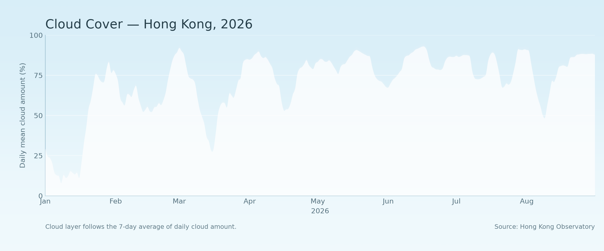

# Cloud Amount — Hong Kong, 2026




## The phenomenon

This project visualises the daily mean amount of cloud recorded at the Hong Kong Observatory in 2026. Cloud amount describes how much of the sky was covered by cloud on average during a day, expressed as a percentage from 0% to 100%. I chose this phenomenon because cloud cover changes noticeably over time and can be represented visually as a changing cloud layer. Instead of presenting the data as a conventional line chart, I wanted the numerical values to become part of the visual language of the phenomenon itself. In the final picture, the height of the white cloud layer represents the amount of cloud: a higher cloud boundary means a higher daily mean cloud amount, while a lower boundary represents less cloud cover.

## The source

The data comes from the [Hong Kong Observatory's published 2026 Daily Mean Amount of Cloud dataset](https://data.weather.gov.hk/weatherAPI/cis/csvfile/HKO/2026/daily_HKO_CLD_2026.csv).
The file contains 243 daily records from 1 January to 31 August 2026. Each row represents one day and includes the year, month, day, daily mean cloud amount, and data completeness. The cloud amount is measured as a percentage (%), where 0% represents no cloud cover and 100% represents complete cloud cover.

## What the picture shows

The picture transforms the daily cloud-cover values into a continuous white cloud layer against a light blue sky. The cloud boundary is smoothed using a 7-day moving average to create a softer visual appearance while preserving the overall changes in cloud cover across the year.
This transformation makes longer-term patterns and changes in cloudiness easier to see, but it hides some of the precise day-to-day fluctuations in the original data. Therefore, the picture is intended to communicate the overall rhythm of cloud cover rather than provide an exact value for every individual day.

## Run it

```
uv run fetch.py
uv run plot.py
```
